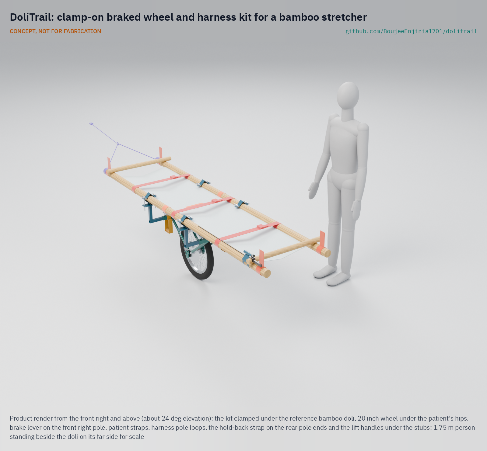
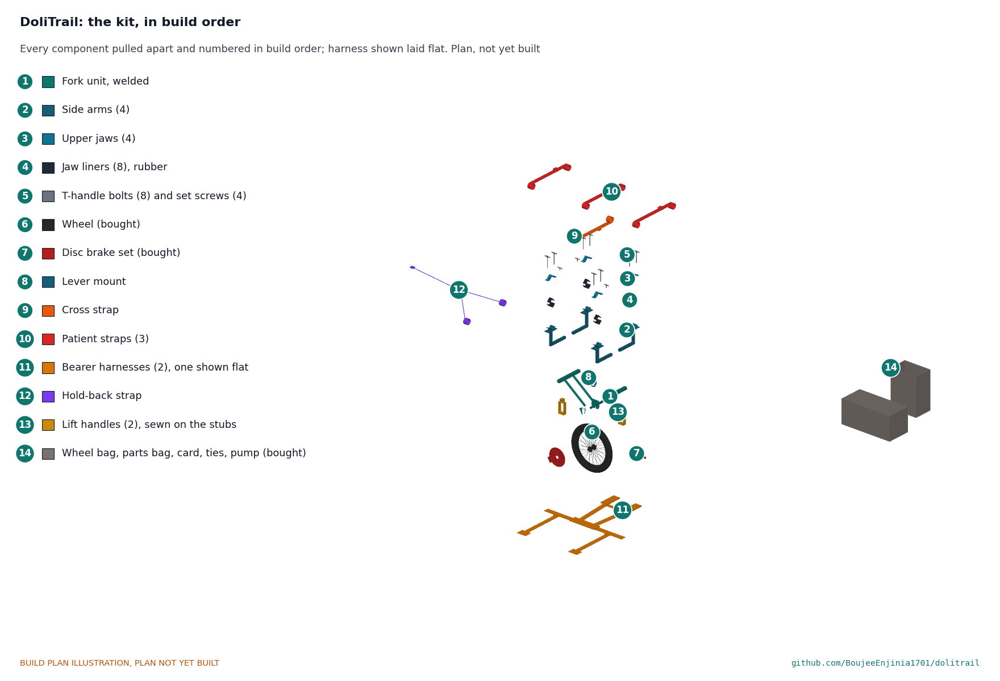

# DoliTrail

   

**Area:** Autonomous and assisted mobility · **TRL:** 3 of 9 (proof of concept on paper; constructable design) · **Value-engineering target:** USD 1,500 (estimated cost USD 482) · **Difficulty:** 3 of 5

Adds a braked wheel and harness to the bamboo stretchers families use to carry patients to the road.

## Concept rationale

Villages without roads already have a way to move a patient: the doli, a stretcher made from bamboo poles and cloth, carried by relatives and neighbours. DoliTrail does not replace it. It adds a clamp-on wheel with a hand brake under the doli and a shoulder harness for the bearers. On level and gentle ground the wheel carries most of the weight and the bearers steer; on descents they hold speed with the brake lever; at steps, rocks and streams they lift the doli and carry it as they do today.

Keeping it as an add-on matters. Families build dolis from what is at hand, so a kit that clamps to poles of different sizes, costs little and can be carried to the village and fitted in minutes is more likely to be used than a new stretcher. The value-engineering target for the parts is USD 1,500 (the constructable design is estimated at USD 482), and the aim is a kit that a block health office or a village health committee can keep ready.

## Burning platform

The same scene repeats across India's hill and forest districts. In August 2026, ambulance staff in Mayurbhanj, Odisha, carried Sumitra Shundhi, in labour, about 7 km on a stretcher across rivers and streams because the 108 ambulance could not reach her village ([ANI, 2026](https://aninews.in/news/national/general-news/pregnant-woman-carried-7-km-on-stretcher-due-to-no-road-connectivity-in-odishas-mayurbhanj20260823102717/)). In Barwani, Madhya Pradesh, relatives carried a pregnant woman 8 km on a stretcher of cloth and bamboo sticks before an ambulance could take her a further 20 km to hospital ([The Tribune, 2021](https://www.tribuneindia.com/news/nation/madhya-pradesh-no-motorable-road-relatives-carry-pregnant-woman-on-makeshift-stretcher-for-8-km-287707)).

In Ri-Bhoi, Meghalaya, village volunteers took turns carrying a woman 36 weeks pregnant for nearly 5 km on a makeshift bamboo stretcher because no vehicle could reach the village ([The Tribune, 2022](https://www.tribuneindia.com/news/nation/pregnant-meghalaya-woman-taken-to-hospital-on-bamboo-stretcher-for-5-km-429099)). In Kondagaon, Chhattisgarh, hospital workers carried a woman 3 km on a hand-made dola over monsoon mud ([Gulf News, 2020](https://gulfnews.com/world/asia/india/india-video-of-a-pregnant-woman-who-was-taken-to-hospital-on-a-handmade-stretcher-has-gone-viral-1.1594298702634)). Each journey depends entirely on the strength of the people carrying.

## Where it could be used

### By industry

| Industry | Use |
| --- | --- |
| Public health and maternal care | Moving women in labour and patients from roadless villages to the ambulance point |
| Emergency medical services | Last-kilometre kit carried in ambulances that serve villages without roads |
| Disaster response | Casualty movement where roads are cut by floods or landslides |
| Mountain and trail rescue | Low-cost wheeled carry for volunteer teams on hill trails |
| Community health programmes | Kit held by village health committees and community health workers |

### By country or region

| Country or region | Why it matters there |
| --- | --- |
| India, Odisha | In August 2026 a woman in labour in Karanjia block, Mayurbhanj, was carried about 7 km across rivers and streams to reach an ambulance ([ANI, 2026](https://aninews.in/news/national/general-news/pregnant-woman-carried-7-km-on-stretcher-due-to-no-road-connectivity-in-odishas-mayurbhanj20260823102717/)). |
| India, Madhya Pradesh | In Barwani district, a forest village with no motorable road carried a pregnant woman 8 km on a cloth and bamboo stretcher ([The Tribune, 2021](https://www.tribuneindia.com/news/nation/madhya-pradesh-no-motorable-road-relatives-carry-pregnant-woman-on-makeshift-stretcher-for-8-km-287707)). |
| India, Meghalaya | Volunteers in Ri-Bhoi district carried a pregnant woman nearly 5 km on a bamboo stretcher over a road that had been in poor condition for years ([The Tribune, 2022](https://www.tribuneindia.com/news/nation/pregnant-meghalaya-woman-taken-to-hospital-on-bamboo-stretcher-for-5-km-429099)). |
| India, Chhattisgarh | In Kondagaon, monsoon mud cut the village off from vehicles and a woman was carried 3 km on a dola ([Gulf News, 2020](https://gulfnews.com/world/asia/india/india-video-of-a-pregnant-woman-who-was-taken-to-hospital-on-a-handmade-stretcher-has-gone-viral-1.1594298702634)). |
| India, Jammu and Kashmir | Army personnel carried a pregnant woman 6.5 km on a stretcher through heavy snow near the Line of Control in Boniyar ([The Tribune, 2022](https://www.tribuneindia.com/news/j-k/watch-army-men-carry-pregnant-woman-to-hospital-amid-heavy-snowfall-in-j-k-359452)). |

## What sparked the idea

On 23 August 2026, the 108 ambulance called for Sumitra Shundhi, in labour in Anlakanta village in Mayurbhanj, Odisha, could not reach her because there was no motorable road. The driver, the attendant and a helper carried her on the ambulance stretcher for about 7 km, crossing rivers and streams, until they reached the vehicle and took her to Karanjia hospital ([ANI, 2026](https://aninews.in/news/national/general-news/pregnant-woman-carried-7-km-on-stretcher-due-to-no-road-connectivity-in-odishas-mayurbhanj20260823102717/)). In many such villages the stretcher is a doli that families make themselves. DoliTrail asks how much of that 7 km a wheel and a brake could carry.

## Problem

In villages with no motorable road, families and health workers carry patients and women in labour for kilometres on hand-made bamboo stretchers to reach an ambulance. The whole weight rides on the bearers' shoulders, on steep, wet and uneven trails.

Full problem statement: [docs/01-problem.md](docs/01-problem.md)

## Concept

A clamp-on braked wheel and shoulder harness that fits the bamboo stretcher (doli) families already use; the bearers roll the patient along the trail, hold speed on descents with the brake lever, and lift it over steps.

Full design precis: [docs/02-concept.md](docs/02-concept.md) · Requirements: [docs/03-requirements.md](docs/03-requirements.md) · Calculations: [docs/04-calcs/01-sizing.md](docs/04-calcs/01-sizing.md) · Prototype build plan: [docs/05-build-plan.md](docs/05-build-plan.md) · Design decisions: [docs/06-design-decisions.md](docs/06-design-decisions.md)

## Key components

- Wheel and fork
- Pole clamps
- Cross frame and strap
- Brake and lever
- Bearer harnesses
- Patient straps
- Hold-back strap and lift handles
- Two carry bags and fitting card

## Building the prototype

The prototype build plan ([docs/05-build-plan.md](docs/05-build-plan.md)) shows how to make the kit and fit it to a doli, component by component, with a making sketch for every made part, close-ups of the joints and a picture for every assembly step. The steel parts are cut, bent, drilled and welded in a village workshop, the harnesses are sewn by a tailor, and the wheel and brake are ordinary bicycle parts. Fitting to a doli takes two people about five minutes and no tools. The plan is a plan, not yet built: the first kit carries sandbags until its proof loads and a wet ramp test have passed.

## Safety

> Safety-critical patient transport equipment. Published as an open engineering reference, never as certified medical or rescue equipment.
>
> Brake failure on a steep descent could lead to a runaway or a fall. Bearers keep hold of the poles at all times and lift and carry on slopes steeper than the tested limit.
>
> Lift and carry across streams and rivers; never roll the doli through moving water.
>
> Check clamps for grip on every fitting, since bamboo varies in size and can split.
>
> Straps must release quickly so the patient can be moved off the doli at once if needed.
>
> The doli rolls on one wheel and can tip sideways: bearers keep both hands on the poles. No person is carried until the frame, clamps and wheel have been proof-loaded (see the build plan, sections 5 and 6).
>
> This design is published as an open engineering reference. It is not certified equipment. CONCEPT, NOT FOR FABRICATION.

## Repository layout

| Folder | Contents |
| --- | --- |
| `docs/` | Problem, concept, requirements, calculations and design decisions |
| `cad/src/` | build123d Python source, the source of truth for all geometry |
| `cad/step/`, `cad/stl/` | Exported models for FreeCAD, other CAD tools and printing |
| `cad/drawings/` | 2D sketches and dimensioned drawings |
| `bom/` | Bill of materials |
| `electronics/` | KiCad schematics and PCB layouts |
| `firmware/` | Microcontroller code |
| `media/` | Renders, perspectives and photos |
| `build-log/` | Dated prototyping notes |

## Documentation

Controlled documents follow the portfolio [documentation standard](.kit/STANDARDS.md). Each carries a document ID (DLT-PRC-001 for the precis), a version and a revision history. Branded PDFs are built with `python .kit/render.py` and attached to GitHub Releases when a document is tagged, for example `DLT-PRC-001/v1.0`.

## Credits

Designed by Amish Chadha at Design Molecule Labs. See [CONTRIBUTORS.md](CONTRIBUTORS.md) for roles. To cite this design, use [CITATION.cff](CITATION.cff) (GitHub shows it as "Cite this repository").

AI assistance (Claude) was used to accelerate prototype documentation and first-pass research. Design direction and all decisions are Amish Chadha's, recorded in this repository's decision records (`docs/decisions/`).

## Licenses

- **Hardware** (CAD, drawings, BOM, electronics): [CERN-OHL-S v2](LICENSE)
- **Software** (firmware, scripts, notebooks): [MIT](LICENSE-SOFTWARE)

A project of the [Design Molecule](https://designmolecule.com) lab.
