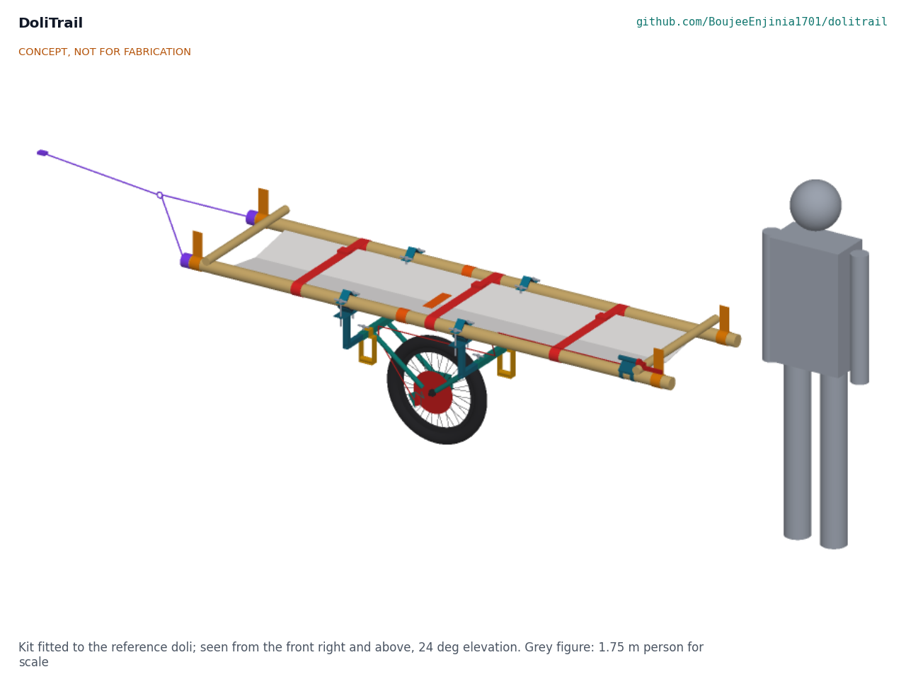
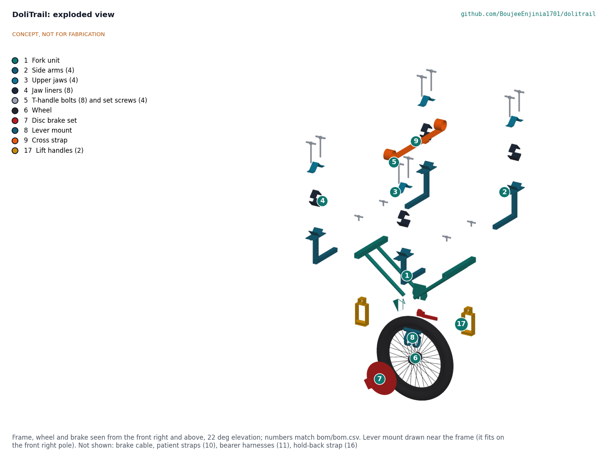
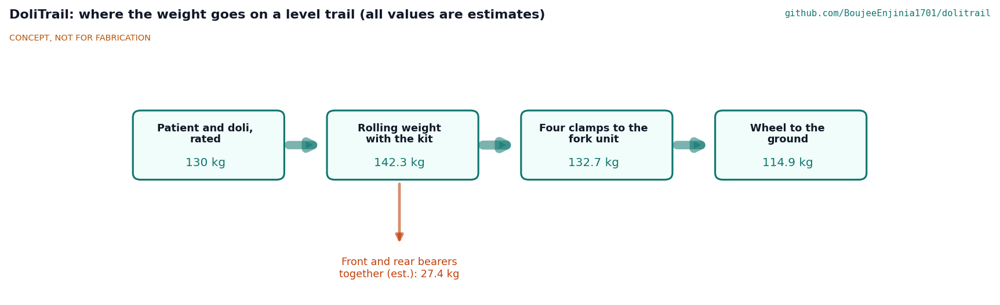

# DoliTrail design precis

Adds a braked wheel and harness to the bamboo stretchers families use to carry patients to the road.

*Figure 1. The kit fitted to the reference doli, with a 1.75 m person for scale (concept render).*

## How it works

DoliTrail is a clamp-on kit for the doli a family has already built. A single 20 inch wheel runs under the patient's hips in a welded steel fork unit. Four side arms slide into the fork unit's two cross stubs, set to the doli's pole spacing, and each ends in a rubber-lined steel V that the bamboo pole sits in; an upper jaw and two T-handle bolts close each clamp by hand. A cross strap round both poles above the wheel keeps the bed from sagging onto the tyre. A disc brake on the wheel is worked by a lever with a parking lock, strapped to the front right pole beside the front bearer's hand. Each bearer wears a harness whose slings take the pole ends at knuckle height, so on level ground and gentle slopes the wheel carries most of the weight and the bearers balance and steer. On descents the front bearer holds speed with the brake, and the rear (uphill) bearer is tied to the rear pole ends by a hold-back strap from the hip belt; on wet clay steeper than 20 per cent the bearers lift and carry. At steps of more than about 250 mm four people lift: the two bearers and two helpers at webbing lift handles on the cross stubs. At rocks and streams the bearers lift the doli and carry it, as they do today. The kit walks in with the two bearers in two bags, and each bought wheel is proof-loaded to 285 kg before the kit is used.

*Figure 2. Cut across the doli through the front pair of clamps.*

## Components

*Table 1. Components (numbers are BOM lines in `bom/bom.csv`).*

| # | Component | Role |
| --- | --- | --- |
| 1 | Fork unit | Welded steel: two 30 mm square cross stubs, four 22 mm struts, dropout plates with the brake caliper lobe |
| 2 | Side arms (4) | Square tube spigot that slides in a stub, a post and a 90 deg V saddle under the pole |
| 3 | Upper jaws (4) | Bent 3 mm steel V over the pole, with two ears for the bolts |
| 4 | Jaw liners (8) | 5 mm rubber in each saddle and jaw: grip on wet bamboo and no crushing points |
| 5 | T-handle bolts (8) and set screws (4) | Close the clamps and lock the arms by hand; no loose tools |
| 6 | Wheel | 20 inch cargo or tricycle wheel, 57-406 knobbly tyre, disc hub, solid axle |
| 7 | Disc brake set | 203 mm rotor, cable caliper with sintered pads, lever with parking lock, cable |
| 8 | Lever mount | Rubber-lined V with a 22.2 mm bar stub, strapped to the front right pole |
| 9 | Cross strap | 50 mm webbing loop round both poles above the wheel, under the bed |
| 10 | Patient straps (3) | Chest, hips and legs; cam buckles with a pull tab |
| 11 | Bearer harnesses (2) | Hip belt, padded shoulder yoke and two adjustable slings ending in pole loops |
| 12 to 15 | Wheel bag, fitting card, cable ties, pump and puncture kit | Carry, fit and keep the kit running |
| 16 | Hold-back strap | Webbing end caps over the rear pole ends, legs to a ring and a tail to the rear bearer's hip belt (decision 7A) |
| 17 | Lift handles (2) | Webbing loops sewn round the cross stubs for two helpers at steps (decision 9A) |
| 18 | Parts bag | Second bag, so each bearer carries one bag (decision 8A) |

*Figure 3. Exploded view of the frame, wheel and brake; numbers match the BOM.*

## Key design choices

- **One wheel under the hips** (DLT-DDR-001, D1). The wheel stays inside the doli's own width; a pair would need a track wider than most trails.
- **Clamp on, adjust by hand** (D2, DLT-DDR-002). Telescoping arms reach poles 450 to 600 mm apart; V saddles self-centre poles of 40 to 80 mm; T-handles mean no spanner is needed.
- **Disc brake with a parking lock** (D3). Works when wet better than a rim brake on a muddy rim; the lock holds the doli when the bearers rest on a slope.
- **Slings, not cups** (D4). A webbing pole loop fits any pole end; the scaffold's "pole-end cups" became loops.
- **Ordinary parts.** Bicycle and cycle-rickshaw parts, mild steel tube a village workshop can weld, webbing a tailor can sew.

## First-order numbers

All from DLT-CAL-001; estimates are marked.

*Table 2. Key figures.*

| Quantity | Value |
| --- | --- |
| Rolling weight: 120 kg patient, 10 kg doli, 12.5 kg fitted kit | 142.5 kg |
| Load per bearer on a level trail (estimate) | about 14 kg, against 65 kg carried by two bearers (79 per cent less) |
| Front bearer on a 30 per cent descent, brake on (estimate) | about 46 kg |
| Brake torque factor on a 30 per cent grade, wet | 1.23 |
| Tyre grip factor on a 30 per cent grade: wet ramp; wet clay | 1.44; 0.84 (lift and carry on wet clay over 20 per cent, where it is 1.37) |
| Clamp slip resistance, one pole, wet | 3.96 kN (factor 2.6 on 1.5 kN) |
| Lowest structural factor on yield at twice the rated load | 2.01 (struts); each wheel proof-loaded to 285 kg |
| Width on the reference doli | 680 mm |
| Kit in two bags; fitted | 7.2 kg and 8.3 kg; 12.5 kg |
| Lift at a 400 mm step, four people | about 36 kg each |
| Fitting time, two people (estimate) | about 4.7 min |
| Estimated parts cost | USD 482 (value-engineering target USD 1,500) |

*Figure 4. Where the weight goes on a level trail (estimates).*

## Patent design-arounds

From the preliminary patent, trademark and prior-art screen (not legal advice), kept unchanged:

- Use DoliTrail's own clamp geometry and colours, distinct from the CMC or Ferno Mule II litter wheel. The DoliTrail clamp is a rubber-lined 90 deg V with a separate jaw and two hand bolts, on telescoping square arms; the colours are teal and blue.
- Confirm that US7922183B2 (Hill-Rom stretcher brake) has lapsed for non-payment of fees before using a similar brake arrangement. DoliTrail uses an ordinary bicycle disc brake on the wheel hub, not a stretcher-mounted brake; the check is still listed in DLT-DEC-001.

## Shared blocks

- CalRig proof-load for clamp, fork, wheel and harness load tests (TRL 4).

## Safety

> **Safety:** Safety-critical patient transport equipment. Published as an open engineering reference, never as certified medical or rescue equipment.
>
> Brake failure or tyre slip on a steep wet descent could lead to a runaway or a fall. Bearers keep hold of the poles at all times, and lift and carry on wet slopes steeper than the tested limit.
>
> The doli rolls on one wheel and can tip sideways. Both bearers steady it with both hands; on a 15 per cent side slope each hand holds about 16 kg up or down.
>
> Lift and carry across streams and rivers; never roll the doli through moving water.
>
> Check every clamp for grip on every fitting, since bamboo varies in size and can split. Tighten by hand only.
>
> Patient straps must release with one pull so the patient can be moved off the doli at once.
>
> No patient is carried until the frame, clamps and wheel have been proof-loaded (DLT-BLD-001, sections 5 and 6).

This design is published as an open engineering reference. It is not certified equipment.
