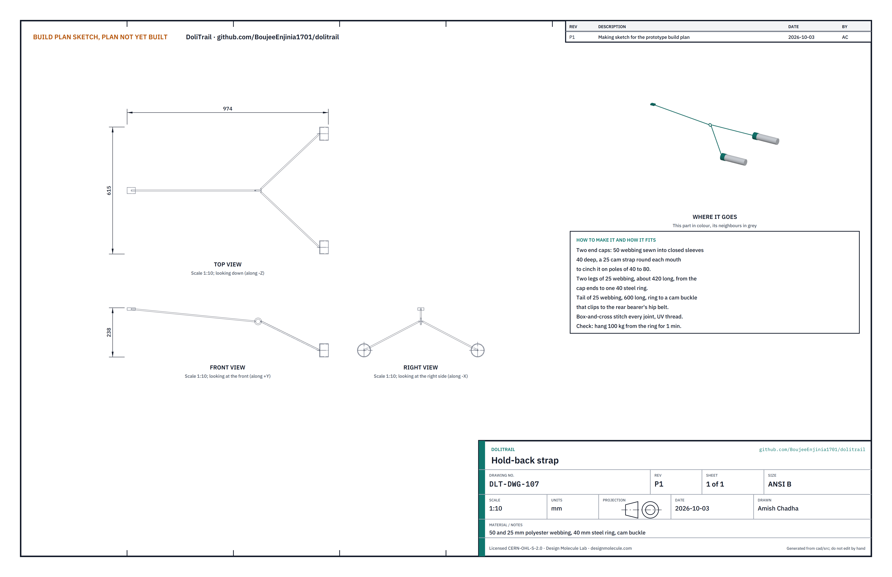
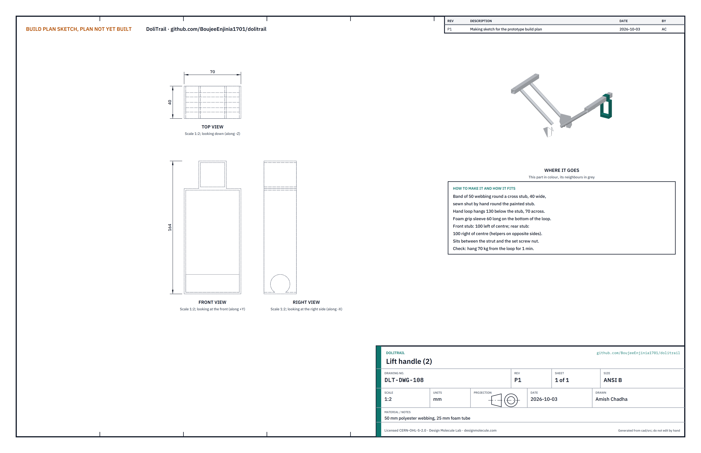

# DoliTrail prototype build plan

**Plan, not yet built.** How to make the first DoliTrail kit and fit it to a doli, component by component. Building and testing to it is TRL 4 work. Decisions are kept in the design decisions register (`docs/06-design-decisions.md`), not here.

> **Safety:** DoliTrail will carry a person over steep, wet ground. It is an open engineering reference, not certified medical or rescue equipment. The first kit carries sandbags, never a patient, until the proof loads and the wet ramp test in sections 5 and 6 have passed. Welding, grinding and cutting need eye, hand and hearing protection and a clear, ventilated space.

## 1. What you are building

*Figure 1. The kit in build order. One harness is shown laid flat; the lift handles are sewn on the fork unit's stubs.*

The kit turns a family's bamboo doli into a wheeled stretcher with a brake. A welded steel fork unit holds a 20 inch wheel; four side arms slide into its two cross stubs and end in rubber-lined V saddles that the bamboo poles sit in, each closed by an upper jaw and two T-handle bolts. A disc brake on the wheel is worked from a lever strapped to the front right pole. A cross strap keeps the bed off the tyre, three patient straps hold the patient, and two harnesses take the pole ends in slings at each bearer's knuckle height. A hold-back strap ties the rear bearer's hip belt to the rear pole ends for descents, and two webbing lift handles sewn round the cross stubs let two helpers lift at steps. The kit walks in with the two bearers in two bags. Eight components are made (the fork unit, side arms, upper jaws, liners, lever mount, harnesses, hold-back strap and lift handles) by cutting, bending, drilling, welding, gluing and sewing; the rest are bought bicycle parts, fasteners, webbing and bags. Parts cost about USD 482. The sizes are for the reference doli: two 60 mm bamboo poles at 550 mm centres; the kit adjusts to poles of 40 to 80 mm at 450 to 600 mm centres.

## 2. What changed to make it buildable

*Table 1. Changes from the concept.*

| Component | The concept had | The buildable design has | Why |
| --- | --- | --- | --- |
| Wheel and fork | "A single wheel in a fork under the middle" | A welded fork unit with two cross stubs fore and aft of the wheel, four struts and dropout plates | The stubs pass below the bed and clear of the wheel; the struts form a stiff truss |
| Pole clamps | "Adjustable clamps with rubber jaws" | Four side arms that slide in the stubs, each with a rubber-lined V saddle, an upper jaw and two T-handle bolts | Fits poles of 40 to 80 mm at 450 to 600 mm centres, by hand |
| Cross frame and strap | One frame and a strap | The fork unit and arms are the frame; the strap is a webbing loop round both poles above the wheel | Keeps the bed 174 mm above the tyre |
| Brake | "Cable or rod brake" | Disc brake with the caliper on a lobe of the left dropout plate | Works wet; the mount is part of the welded plate |
| Lever | "At the front bearer's hand" | A rubber-lined lever mount strapped on the front right pole | A bicycle lever needs a 22.2 mm bar |
| Harness | "Pole-end cups" | Pole loops on adjustable slings | Fits every pole end and bearer |
| Wheel fixing | Not stated | Solid axle and nuts in slots open downward | Nothing to open by mistake |
| Bed | Not considered | Clamps on bare pole; the bed's lashing is slid aside at the four clamp points | The inboard bolt passes beside the pole |
| Descents on wet ground | Brake only | A hold-back strap: webbing caps over the rear pole ends, legs to a ring, a tail to the rear bearer's hip belt | The tyre can slide on wet clay before the brake slips; the uphill bearer holds the doli back |
| Steps | Two bearers lift | Two webbing lift handles sewn round the cross stubs for two helpers | Four people share the lift, about 36 kg each |
| Carrying the kit | One bag | Two bags, one per bearer: about 7.2 and 8.3 kg | Each load stays under 10 kg |

*Figure 2. Cut across the doli through the front clamps: the poles sit in the saddles, the wheel runs between the stubs.*

## 3. Making the components

Make and paint the steel parts in the workshop, glue in the liners and sew the harnesses before the kit goes anywhere near a doli.

### 3.1 Fork unit

**What it is and what it is made from.** The backbone of the kit: two cross stubs of 30 x 30 x 2 mm square steel tube, 320 mm long, joined by four struts of 22.2 x 1.6 mm round tube to two 5 mm steel dropout plates that hold the wheel axle. The left plate has a lobe that carries the brake caliper. Mild steel tube and plate, welded and painted.

**How to make it.**

1. Cut the two stubs 320 mm long, square ends. Drill a 9 mm hole in the top face of each, 135 mm either side of the centre, and weld an M8 nut over each hole.
2. Cut the two dropout plates from 5 mm plate to the outline on the sketch: a slot 10 mm wide running up from the bottom edge, with the axle centre at its top. Add the caliper lobe to the left plate and drill it for the caliper adapter.
3. Set the stubs in a jig, parallel, 600 mm apart centre to centre and level. Set the plates on a 3/8 inch spacer bar with a 100 mm spacer between them, the axle centre 233 mm below the stub undersides and midway between the stubs.
4. Cut the four struts about 380 mm long and mitre both ends so they sit flat on the stub underside and on the outer face of the plate, with their centre lines 64 mm either side of the middle.
5. Tack, check the dropouts are square to the stubs and 100 mm apart, then weld fully. Grind the slot clean, prime and paint.

**How it fits the parts next to it.**

*Figure 3. A side arm's spigot in a cross stub, cut. The set screw locks it.*

The side arms' spigots slide into the stub ends with about 0.5 mm clearance each side; a T-handle set screw through each welded nut presses down on the spigot. The wheel axle drops up into the slots (Figure 5), and the caliper bolts to the inside of the lobe (Figure 6).

**Check before moving on.** A 3/8 inch rod slides through both slots square to the stubs; a stub offcut of the arm tube slides in each stub end by hand without rocking; no weld spatter in the stub bores.

### 3.2 Side arms

**What it is and what it is made from.** Four L-shaped arms of 25 x 25 x 1.6 mm square tube. Each has a 230 mm spigot that slides into a stub, a 145 mm post welded on top at its outer end, and a 60 x 130 x 4 mm saddle plate on the post carrying a 90 deg V of 3 mm plate, 60 mm wide inside. Two M8 nuts are welded under the plate ears.

**How to make it.**

1. Cut four spigots 230 mm and four posts 145 mm from the square tube.
2. Weld each post on top of its spigot, flush with the outer end, square in both directions (use the same jig for all four).
3. Cut the saddle plates 60 x 130 mm; drill two 9 mm holes 52 mm either side of the centre line; weld M8 nuts underneath.
4. Bend 3 mm plate 60 mm wide into a 90 deg V with 30 mm legs, and weld it along the plate centre line, the V running along the pole.
5. Weld the plate on top of the post, the V centred over it and running square across the spigot, so the pole lies along the doli. Grind, prime and paint.

**How it fits the parts next to it.**

*Figure 4. A pole clamp, cut across: the pole in the rubber-lined V, the upper jaw over it, two T-bolts into the nuts under the saddle.*

The bamboo pole lies in the V on its rubber liner; the upper jaw closes over it and the two T-handle bolts pass through the jaw's ears into the nuts under the saddle plate.

**Check before moving on.** Every arm slides into every stub end; the V is square to the spigot; a 60 mm pipe sits in the V touching both faces.

### 3.3 Upper jaws

**What it is and what it is made from.** Four strips of 3 x 40 mm steel, 190 mm long, bent into an inverted 90 deg V with two flat ears, 130 mm over the ears.

**How to make it.**

1. Cut the strips 190 mm long.
2. Bend at the centre to 90 deg over a former in a vice; then bend each leg flat to make the ears, so both ears lie level.
3. Drill 9 mm holes in the ears at 104 mm centres. Deburr and paint.

**How it fits the parts next to it.** The jaw sits over the pole on its own liner; its ears take the T-handle bolts (Figure 4). On a 40 mm pole the ears come down to about 28 mm above the saddle ears; on an 80 mm pole they rise about 28 mm.

**Check before moving on.** The jaw's holes line up with the saddle nuts when it sits over a 60 mm pipe in the saddle.

### 3.4 Jaw liners

**What it is and what it is made from.** Eight pads of 5 mm rubber sheet, or three layers of truck inner tube glued together: 56 x 84 mm for the saddles and 38 x 94 mm for the jaws.

**How to make it.**

1. Cut the pads with a sharp knife against a straightedge.
2. Fold each along its centre line.
3. Coat the pad and the inside of the V with contact adhesive, wait ten minutes, press in and roll flat.

**How it fits the parts next to it.** The liner covers both faces of the V and stops short of the bolt holes. The pole bears only on rubber.

**Check before moving on.** No loose edges; the pad cannot be peeled by hand.

### 3.5 T-handle bolts and set screws (bought)

Buy eight M8 x 130 mm T-handle bolts with 25 mm washers for the clamps, and four M8 x 40 mm T-handle set screws for the arms, zinc plated. Run each into its welded nut once to clean the thread.

### 3.6 Wheel (bought)

Buy a 20 inch (ISO 406) cargo or tricycle wheel with a double-wall rim, 36 spokes of 2.0 mm or heavier and a steel front disc hub 100 mm over the locknuts, with a solid 3/8 inch axle and nuts (not quick release). Fit a 20 x 2.125 knobbly tyre and tube. Bolt the 203 mm rotor to the hub on the left side. Check the seller's ratings against the design decisions register.

*Figure 5. The axle in the dropout slots, cut: nuts outside the plates.*

### 3.7 Disc brake set (bought)

Buy a cable-operated disc caliper with sintered pads and a post-mount adapter, a 203 mm six-bolt rotor, a brake lever for a 22.2 mm bar with a parking lock, and 2.2 m of cable and housing. Fit the adapter to the caliper lobe of the left dropout plate.

*Figure 6. The caliper bolted to the lobe, the rotor running in its slot.*

### 3.8 Lever mount

**What it is and what it is made from.** A 110 mm stub of 22.2 x 1.6 mm tube, welded along the apex of an 80 mm long inverted V of 3 mm plate, with a 5 mm rubber liner inside the V and two 25 mm webbing cam straps.

**How to make it.**

1. Bend 3 mm plate 80 mm wide into a 90 deg V, 68 mm across the open side.
2. Weld the tube stub along the outside of the apex, centred, ends square. Paint.
3. Glue a rubber liner inside the V.
4. Sew two 25 mm webbing straps with cam buckles to pass round the pole, 28 mm either side of the centre.

**How it fits the parts next to it.**

*Figure 7. The lever mount on top of the front right pole, strapped round it; the brake lever clamps on the bar beyond the V.*

**Check before moving on.** On a 60 mm pipe, strapped tight, the mount does not turn when the lever is pulled hard.

### 3.9 Cross strap and patient straps (bought)

Buy 50 mm polyester webbing: one cross strap of 1.6 m with a cam buckle, and three patient straps of 1.8 m with cam buckles and a red pull tab. Heat-seal every cut end.

*Figure 8. The cross strap round both poles above the wheel, under the bed.*

*Figure 9. A patient strap round both poles; one pull on the tab frees it.*

### 3.10 Bearer harnesses

**What it is and what it is made from.** Two harnesses sewn by a tailor from 50 mm polyester webbing: a 1,000 mm hip belt with a foam pad, two padded shoulder straps joined by a chest strap, and two slings, each ending in a pole loop about 110 mm across, with cam buckles to set the length.

**How to make it.**

1. Cut and heat-seal the webbing: belt 1,000 mm, shoulder straps 600 mm, chest strap 300 mm, slings 500 mm, loops 400 mm.
2. Sew the shoulder straps to the belt at the back, 180 mm apart, crossing to the front; add the pads and the chest strap.
3. Sew a sling to each side of the belt, 660 mm apart; fit a cam buckle in each sling.
4. Fold each loop and box-and-cross stitch it to its sling with UV-resistant thread.

**How it fits the parts next to it.**

*Figure 10. A harness pole loop on a pole end; the sling runs up to the bearer's yoke.*

**Check before moving on.** Hang 50 kg from each loop for one minute: no stitch pulls.

### 3.11 Two carry bags, fitting card, ties and pump (bought)

Two bags, one for each bearer. A canvas wheel bag about 700 x 340 x 560 mm with shoulder straps takes the fork unit with the wheel, brake and lift handles, and the pump kit: about 7.2 kg packed. A canvas backpack of about 45 litres takes the side arms, jaws, bolts, lever mount, straps, harnesses, hold-back strap and the fitting card: about 8.3 kg packed. Also buy an A4 laminated fitting card with the pictures of section 4 and the safety stops; eight hook-and-loop ties; a mini pump, tyre levers, patches and a spare tube.

### 3.12 Hold-back strap

**What it is and what it is made from.** A Y-shaped strap sewn by a tailor that lets the rear (uphill) bearer hold the doli back on a wet descent. Two closed end caps of 50 mm polyester webbing, 40 mm deep, slip over the rear pole ends, each with a 25 mm cam strap round its mouth; two 25 mm webbing legs, about 420 mm long, run from the caps to a 40 mm steel ring; a 600 mm tail runs from the ring to a cam buckle that clips to the rear bearer's hip belt.

**How to make it.**

1. Cut and heat-seal the webbing: two cap pieces of 50 mm webbing 300 mm long, two legs and a tail of 25 mm webbing.
2. Sew each cap into a closed sleeve that fits over an 80 mm pole end, and sew a 25 mm cam strap round its mouth so it cinches down onto a 40 mm pole.
3. Sew one end of each leg to the closed end of a cap, and the other end round the ring. Sew the tail round the ring and fit the cam buckle on its free end.
4. Box-and-cross stitch every joint with UV-resistant thread.

**How it fits the parts next to it.**

*Figure 11. A hold-back cap on a rear pole end, just behind the harness pole loop.*

Each cap goes over a rear pole end, cinched tight, so the pull bears on the end of the pole and the cap cannot slide off backward. It sits about 5 mm behind the harness pole loop. The tail clips to the rear bearer's hip belt and is set so the bearer leans back slightly against it.

**Check before moving on.** Hang 100 kg from the ring for one minute, with both caps on a length of 60 mm pole: no stitch pulls and neither cap moves.

### 3.13 Lift handles

**What it is and what it is made from.** Two handles of 50 mm polyester webbing, one on each cross stub of the fork unit, for two helpers at steps. Each is a 40 mm wide band sewn shut round the stub with a hand loop hanging 130 mm below it, 70 mm across, with a 60 mm foam grip on the bottom of the loop.

**How to make it.**

1. After the fork unit is painted, wrap the webbing round the front stub 100 mm to the left of its centre and sew it shut by hand, tight on the stub.
2. Sew the hand loop below it, and slide the foam tube on before closing the loop.
3. Do the same on the rear stub, 100 mm to the right of its centre, so the two helpers stand on opposite sides of the doli.

**How it fits the parts next to it.**

*Figure 12. A lift handle on the front cross stub, between the strut and the set screw.*

The band sits between the strut and the set screw's nut, so it cannot slide into either. The loop hangs 69 mm clear of the tyre, with about 160 mm of room for a hand under the pole and the bed. The handles stay on the fork unit and travel in the wheel bag.

**Check before moving on.** Hang 70 kg from each loop for one minute: no stitch pulls and the band does not slide on the stub.

## 4. Putting it together

Steps 1 to 4 are done once in the workshop; the wheel and the lift handles then stay on the fork unit. Steps 5 to 9 are the fitting to a doli, about five minutes for two people.

### Step 1: fit the rotor and the wheel

Bolt the rotor to the hub (left side) to the torque on its packet. Lift the axle up into both slots and tighten the nuts outside the plates with a spanner. Spin the wheel: it runs true and clear of the struts.

### Step 2: bolt the caliper to the lobe

Bolt the caliper and adapter to the lobe, centre it on the rotor, set the pads about 0.5 mm off, and run the cable through the housing to the lever (the lever stays loose for now).

### Step 3: slide the side arms into the stubs

Slide each arm into its stub end, posts upward and outward. Set the saddles to the doli's pole spacing (measure centre to centre).

### Step 4: lock the set screws

Tighten the four set screws by hand. Each spigot must be at least 75 mm inside its stub.

### Step 5: set the frame under the poles, wheel under the hips

Two people raise the doli on their knees or on two blocks. Slide the frame under it so the wheel sits under the patient's hips (the belt line), and the saddles sit under both poles at bare pole, sliding any bed lashing about 70 mm aside.

### Step 6: close the four clamps

Lay each upper jaw over its pole; run both T-bolts into the nuts in even turns until the rubber just bulges. Hand tight only, never with a bar.

### Step 7: fit the cross strap

Pass the strap round both poles just ahead of the wheel's top, under the bed, and pull it tight.

### Step 8: fit the lever mount on the front right pole

Strap the mount on top of the front right pole about 150 mm behind where the front bearer's pole loop will sit. Clamp the lever on its bar, blade toward the bearer's hand. Tie the housing along the arm and the pole with the hook-and-loop ties, with no tight bends. Pull the lever: the wheel locks; set the parking lock: it stays locked.

### Step 9: patient straps, harness loops and hold-back strap

Pass the three patient straps round both poles at the chest, hips and legs. The bearers put on their harnesses, set the slings to knuckle height and slip the pole loops over the pole ends. Slip the hold-back caps over the rear pole ends behind the rear bearer's pole loops, cinch them, and clip the tail to the rear bearer's hip belt.

## 5. First checks

These are listed here and recorded in a TRL 4 test report. Sandbags stand in for a patient.

*Table 2. First checks.*

| Check | Requirement | How | Pass when |
| --- | --- | --- | --- |
| Clamp range | R1 | Close a clamp on 40, 60 and 80 mm bamboo | Both liners touch; jaw clear of the saddle |
| Clamp slip | R1 | Pull the fitted frame along the poles with CalRig | No slip at 1.5 kN on wet poles |
| Proof load | R3 | 260 kg of sandbags on the fitted doli, wheel on a block, 10 min | No permanent set in the frame, no weld cracks, no clamp movement |
| Wheel proof load | R3 | Every bought wheel, before the kit is used: 285 kg on the wheel alone, tyre at full pressure, 10 min | No spoke, rim or tyre damage; if it fails, fit the heavier 20 inch tricycle wheel and 20 x 2.4 cargo tyre and repeat |
| Fitting time | R2 | Two people with only the fitting card | Under 5 min |
| Bearer load | R4 | Load cells in the slings, level trail | Average load per bearer down by 60 per cent or more |
| Brake hold | R5 | Rated sandbag load on a wet 30 per cent ramp, lever locked | Stays put for 5 min |
| Hold-back strap | R5 | Rated sandbag load on a wet ramp, rear bearer clipped in, pull measured | The bearer holds the doli back standing upright |
| Width | R6 | Measure over the clamps | 700 mm or less on the reference doli |
| Mass | R7 | Weigh each packed bag | Each bag 10 kg or less |
| Step | R8 | 400 mm step, four people: two bearers and two helpers at the lift handles | Over without removing the wheel; recorded load per person about 36 kg |
| Release | R10 | Pull each tab, gloved hand | Free in 3 s |
| Brake reach | R11 | Bearers of 1.5 to 1.8 m | Lever and lock worked without letting go |

## 6. Safety stops

Work stops at each point until what is listed is true.

- **S1, before welding:** jig checked square; fire extinguisher and screens in place.
- **S2, before any load:** every weld inspected by eye for cracks and full fusion; every set screw and T-bolt tight; wheel nuts tight.
- **S3, before the proof loads (frame and every bought wheel):** sandbags only; people stand clear of the doli's sides; the wheel rests on a block.
- **S4, before the wet ramp test:** the proof loads (section 5) have passed; a person holds a safety rope to the rear poles; the ramp has a run-out clear of people.
- **S5, before any trail trial with a person:** the ramp test has passed, the bearers have practised with sandbags, and the partner's crew agree. The first person carried is a healthy volunteer, not a patient. Bearers keep both hands on the poles and never roll through moving water. On every wet descent the rear bearer is clipped to the hold-back strap; on wet clay steeper than 20 per cent the bearers lift and carry. At steps of more than about 250 mm four people lift, two of them at the lift handles; two bearers never lift the fitted doli over a step alone.
- **S6, every fitting:** clamps checked by shaking the doli; poles checked for splits at the clamp points; brake pulled and the lock tried before anyone is strapped on.

## 7. Tools, skills and workspace

- Workshop: a welder (stick or MIG) and a competent welder; angle grinder with cutting and grinding discs; drill press or hand drill with 9 mm bit; bench vice and a 90 deg bending former; files; a flat bench for the jig.
- Tailor: a heavy sewing machine for webbing, UV-resistant thread, a hot knife for sealing.
- Bicycle mechanic: spoke key, 15 mm spanner, Torx or hex keys for the rotor and caliper, cable cutters.
- Fitting: no tools beyond the kit; the T-handles are turned by hand.
- Space: a covered workshop for the steel; a level yard and a test ramp for the checks.

## 8. Where the numbers come from

- Model: `cad/src/model.py` (sizes, constructability checks), `cad/step/` and `cad/stl/`.
- Drawings: `cad/drawings/DLT-DWG-001` (general arrangement) and `DLT-DWG-101` to `108` (making sketches).
- Calculations: `docs/04-calcs/01-sizing.md` (DLT-CAL-001), `docs/04-calcs/sizing.py`, `docs/04-calcs/results.csv`.
- Bill of materials: `bom/bom.csv`.
- Pictures: `cad/src/build_plan_media.py`.
